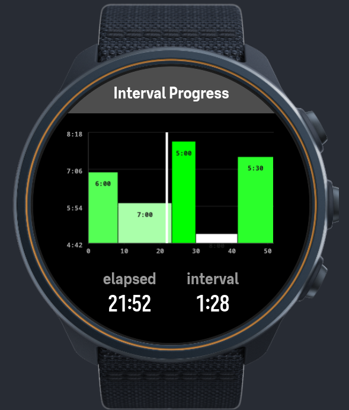

# Interval Visualization

SuuntoPlus sports app that draws a bar chart of workout intervals during exercise. Each bar's width = interval duration, height = target pace (color-graded green/fast → white/slow), with a live white marker showing elapsed time plus elapsed and current-interval countdowns.



## Files

| File | Role |
|------|------|
| `manifest.json` | Metadata, resource subscriptions, settings schema, template list |
| `main.js` | ESW lifecycle stubs; `getUserInterface` returns the template |
| `interval-chart.html` | `<uiView>` template: canvas chart + subscriptions + layout |
| `data.json` | Initial setting values |
| `reference.html` | Local SuuntoPlus API reference (not deployed) |

## Configuration

Single setting, `Intervals`, parsed in `interval-chart.html` on load:

```
duration:pace;duration:pace;...
```

- `duration` — seconds
- `pace` — seconds per unit, drives bar height and color
- Example: `500:360;900:420;400:300` = 500 s @ 3:60 pace, then 900 s @ 4:20, …

Max 255 bytes (~30 pairs). Malformed pairs are skipped; empty/invalid string falls back to the hardcoded default in `interval-chart.html`.

Keep three places in sync when changing defaults: `manifest.json` `settings[]`, `data.json`, and the fallback string in `interval-chart.html`.

## Data flow

Live time comes from `$.subscribe('/Activity/Move/-1/Duration/Current', ...)` in the template's `onActivate` — not from `evaluate()`. The subscriber updates the text fields and calls `control('#intervalChart', 'REFRESH')` to redraw the canvas. `onDeactivate` unsubscribes.

## Development

No build, tests, or lint. Edit, then deploy via **SuuntoPlus Editor** (Windows/macOS, USB or Bluetooth) and verify on-device by starting an exercise.

Primary target: Display ID `q` (466×466 px) — Suunto Race, Race S, Race 2, Vertical 2, Ocean, Ocean Lite. Layout is percentage-based, so it scales to other round displays.

See `AGENTS.md` for full development rules.
